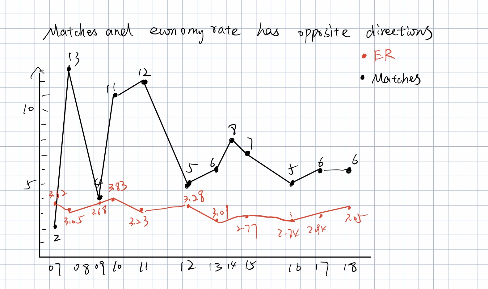

Here is the original data source of the data visualization.

Source: [https://www.espncricinfo.com/story/aakash-chopra-how-ishant-sharma-got-his-mojo-working-1156540](https://www.espncricinfo.com/story/aakash-chopra-how-ishant-sharma-got-his-mojo-working-1156540)

The title of the graph: The ISHANT'S ECONOMY RATE

**Changes I made for the first sketch:**
* I change the type of the chart from accumulate bar chart to line chart because this is time series data, so line chart could show the trend better.
* I change the color of the two features, the orignal color are too similar to each other, people could not tell the difference of them.
* I change the title of the chart so it could summarize the information in the chart.

**The first sketch of the fixed data visualization.**

     
**Suggestion from other people:**
* People A: Use dual axis because the two features are in different scale

* People B: 1. Change the title 2. Delete the data points on the graph which are not useful

**Changes I made after the suggestions:**
* I change the title to show accurate meaning of the graph.
* I use dual axis because of the different scales of the two features to show the trend more clearly.

**The final version of the data visualization:**

<noscript></noscript><object class='tableauViz'  style='display:none;'><param name='host_url' value='https%3A%2F%2Fpublic.tableau.com%2F' /> <param name='embed_code_version' value='3' /> <param name='site_root' value='' /><param name='name' value='Assignment3_16635338725130&#47;Sheet1' /><param name='tabs' value='no' /><param name='toolbar' value='yes' /><param name='static_image' value='https:&#47;&#47;public.tableau.com&#47;static&#47;images&#47;As&#47;Assignment3_16635338725130&#47;Sheet1&#47;1.png' /> <param name='animate_transition' value='yes' /><param name='display_static_image' value='yes' /><param name='display_spinner' value='yes' /><param name='display_overlay' value='yes' /><param name='display_count' value='yes' /><param name='language' value='en-US' /><param name='filter' value='publish=yes' /></object>
                
