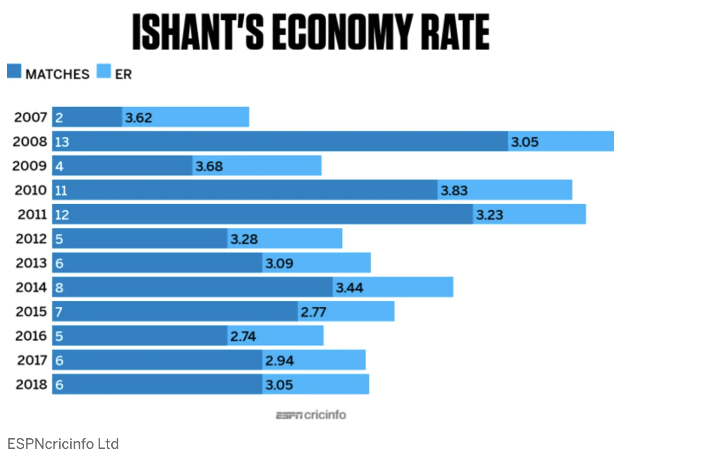

Here is the original data source of the data visualization.

Source: https://www.espncricinfo.com/story/aakash-chopra-how-ishant-sharma-got-his-mojo-working-1156540

The title of the graph: The ISHANT'S ECONOMY RATE

The first sketch of the fixed data visualization.

     
Recommendation from other people:
* People A: Use dual axis because the two features are in different scale

* People B: 1. Change the title 2. Delete the data points on the graph which are not useful
