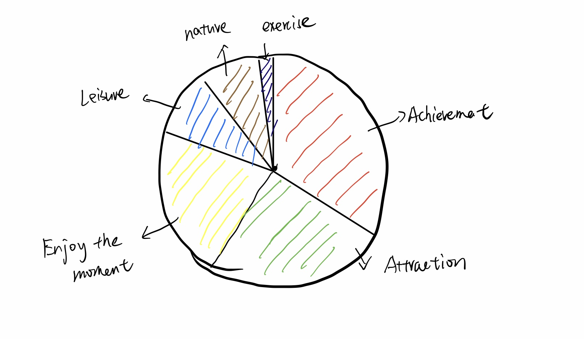
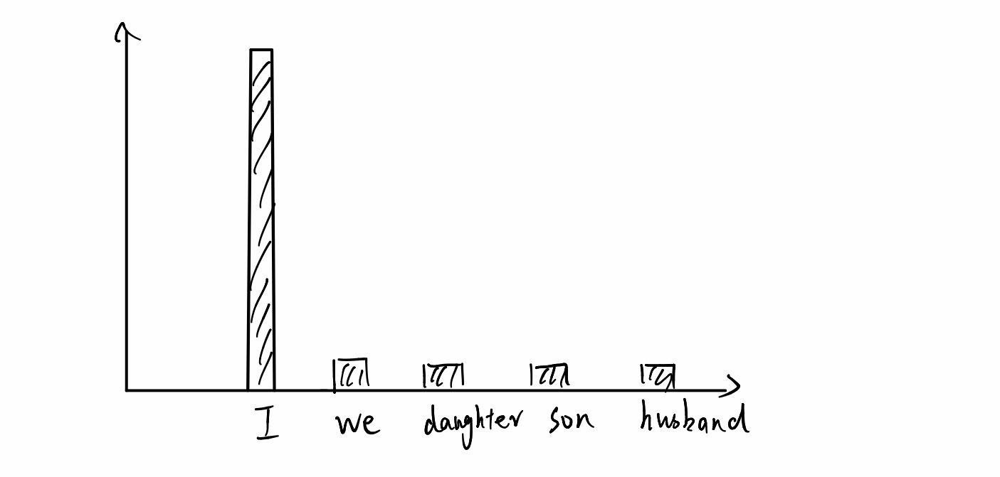
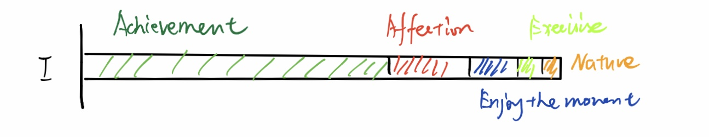
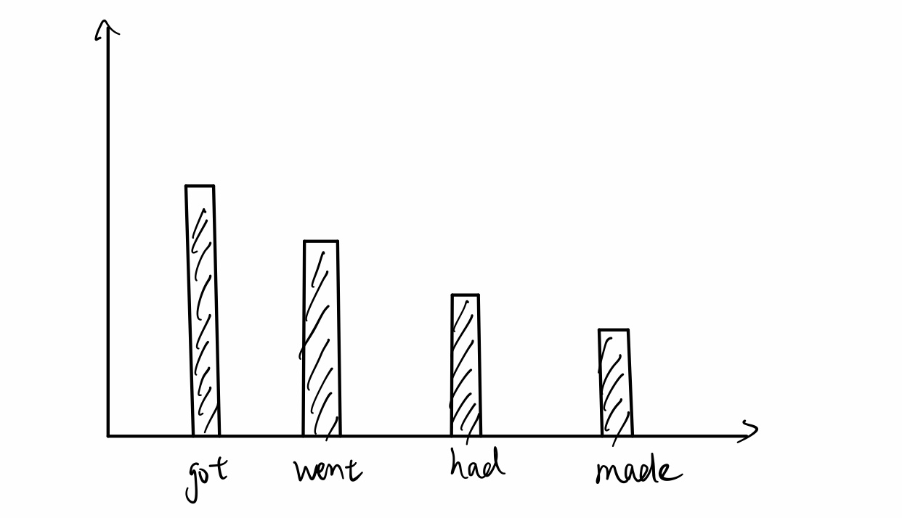
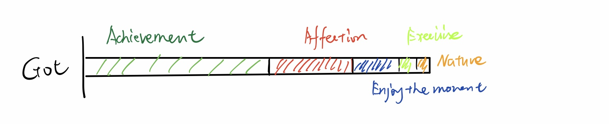
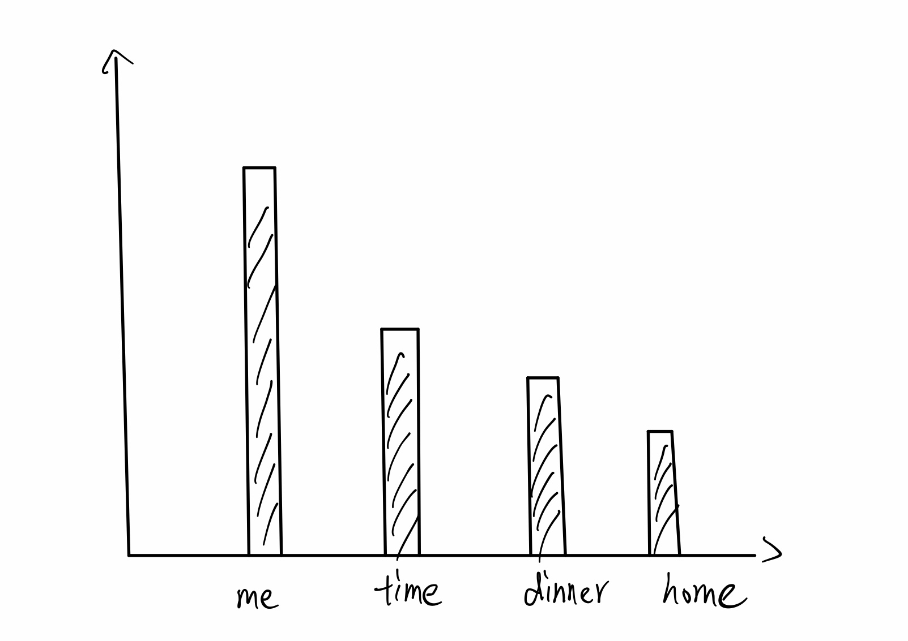

# Outline
what is your happiest moment recently? Visualize the distribution of people's happy moment in differnet categories and
the distribution of words from subject's, verb's, and object's perspective according to the survey data. 

# Sketches
1. The happy moment category distribution by pie chart

2. The happy moment subject distribution by bar chart

3. For the top 3 subject, distribution of categories by stacked bar chart

4. The happy moment verb distribution by bar chart

5. For the top 3 verb, distribution of categories by stacked bar chart

6. The happy moment object distribution by bar chart

7. For the top 3 object, distribution of categories by stacked bar chart

# Data
[HappyDB](https://github.com/megagonlabs/HappyDB)
I will clone the repository from github to download the data to local path and analyze the data with python.

# Medium
I will utilize shorthand for the presentaton, Tableau to prepare charts with data and python to analyze data for the final project.
[shorthand](https://shorthand.com/)
